# Branch Protection Rules Configuration

To ensure proper CI/CD flow, configure the following branch protection rules for the `main` branch in GitHub.

## How to Configure

1. Go to your repository on GitHub
2. Navigate to **Settings** → **Branches**
3. Click **Add rule** or edit existing rule for `main` branch
4. Apply the settings below

## Recommended Branch Protection Rules

### Branch name pattern
```
main
```

### Protection Rules

#### ✅ **Restrict pushes that create files**
- [ ] Restrict pushes that create files

#### ✅ **Require a pull request before merging**
- [x] **Require a pull request before merging**
- [x] **Require approvals: 1** (adjust based on team size)
- [x] **Dismiss stale pull request approvals when new commits are pushed**
- [x] **Require review from code owners** (if you have CODEOWNERS file)

#### ✅ **Require status checks to pass before merging**
- [x] **Require status checks to pass before merging**
- [x] **Require branches to be up to date before merging**

**Required status checks** (must all pass):
```
CI / Validate Changes
```

#### ✅ **Require conversation resolution before merging**
- [x] **Require conversation resolution before merging**

#### ✅ **Require signed commits**
- [ ] **Require signed commits** (optional, recommended for security)

#### ✅ **Require linear history**
- [x] **Require linear history** (prevents merge commits, enforces rebase/squash)

#### ✅ **Require deployments to succeed before merging**
- [ ] **Require deployments to succeed before merging** (if you have deployments)

#### ✅ **Lock branch**
- [ ] **Lock branch** (only if you want to completely prevent pushes)

#### ✅ **Do not allow bypassing the above settings**
- [x] **Do not allow bypassing the above settings**

#### ✅ **Restrict who can push to matching branches**
- [x] **Restrict pushes that create files**
- **Who can push**: Only administrators and maintainers

## Workflow Overview

With these settings, the development flow will be:

```mermaid
graph LR
    A[Create Feature Branch] --> B[Make Changes]
    B --> C[Push to Feature Branch]
    C --> D[Create Pull Request]
    D --> E{CI Checks Pass?}
    E -->|❌ No| F[Fix Issues]
    F --> C
    E -->|✅ Yes| G[Code Review]
    G --> H{Approved?}
    H -->|❌ No| I[Address Feedback]
    I --> C
    H -->|✅ Yes| J[Merge to Main]
    J --> K[Auto Release Trigger]
    K --> L[NPM Publish]
```



## Benefits

### 🔒 **Quality Gates**
- No code reaches `main` without passing CI
- All E2E tests must pass before merge
- Code quality checks enforced
- Build integrity verified

### 👥 **Team Collaboration**
- Code review required for all changes
- Conversations must be resolved
- Stale approvals dismissed on new commits

### 🚀 **Release Safety**
- `main` branch always contains validated code
- Release workflow can safely skip validations
- Faster release process

### 📋 **Compliance**
- Linear history for clean git log
- Required status checks prevent broken merges
- Optional signed commits for security

## Example GitHub CLI Commands

You can also configure these rules using GitHub CLI:

```bash
# Create branch protection rule
gh api repos/:owner/:repo/branches/main/protection \
  --method PUT \
  --field required_status_checks='{"strict":true,"contexts":["CI / Validate Changes"]}' \
  --field enforce_admins=true \
  --field required_pull_request_reviews='{"required_approving_review_count":1,"dismiss_stale_reviews":true}' \
  --field restrictions=null \
  --field required_linear_history=true \
  --field allow_force_pushes=false \
  --field allow_deletions=false \
  --field required_conversation_resolution=true
```

## Testing the Configuration

After setting up branch protection:

1. Create a test feature branch
2. Make a small change
3. Create a PR to `main`
4. Verify CI runs automatically
5. Verify you cannot merge until CI passes
6. Test that merge is blocked if CI fails

## Troubleshooting

### ❌ Status Check Not Found
If "CI / Validate Changes" doesn't appear in the dropdown:
1. Make sure you've pushed a PR that triggers the CI workflow
2. The status check name must exactly match the job name in `.github/workflows/ci.yml`
3. Wait for the workflow to run at least once

### ❌ Can't Merge Even When CI Passes
Check:
1. All required status checks are passing
2. All conversations are resolved
3. PR is up to date with main branch
4. Required approvals are met

### ❌ CI Not Running on PRs
Verify:
1. `.github/workflows/ci.yml` exists
2. Workflow targets `pull_request` events on `main` branch
3. Draft PRs are excluded (unless you want them to run)